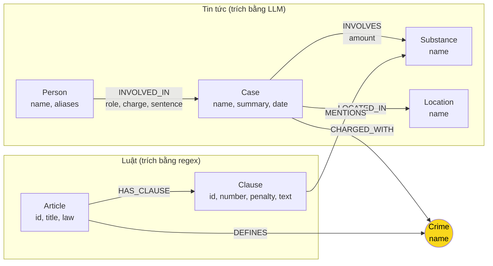

# Thiết kế Ontology — Day 19

**Họ tên:** Nguyễn Ngọc Hân  **MSSV:** 2A202602511

**Lựa chọn** (đánh dấu một):
- [x] Dùng ontology gợi ý (có thể chỉnh nhỏ)
- [ ] Tự thiết kế (xét bonus +15, xem `SUBMISSION.md`)

> Ontology này là ontology gợi ý trong `src/graph.py`, dùng nguyên (không xét bonus). Các mục dưới mô tả đúng những gì code KG-2 thật sự ghi vào Neo4j.

## 1. Sơ đồ



Node cầu nối: **`Crime`** (màu vàng).

## 2. Entity types (node labels)

| Label | Ý nghĩa | Khóa định danh (`MERGE` theo) | Properties | Lấy từ KB nào | Trích bằng (regex / LLM / khác) |
| --- | --- | --- | --- | --- | --- |
| `Article` | Một Điều luật | `id` ("Điều 251 BLHS") | `id`, `title`, `law`, `doc_id` | Luật | regex (`parse_law_article`) |
| `Clause` | Một khoản trong Điều | `id` ("Điều 251 BLHS khoản 1") | `id`, `number`, `penalty`, `text`, `doc_id` | Luật | regex (`parse_law_article`) |
| `Crime` | Tội danh chuẩn hóa | `name` (đã `normalize_crime`) | `name` | Luật (tiêu đề Điều) + tin (đã link) | regex (luật), LLM + `link_entity` (tin) |
| `Case` | Một vụ việc trong bài báo | `name` (do LLM đặt) | `name`, `summary`, `date`, `source_title`, `doc_id` | Tin | LLM (`extract_news_cases`) |
| `Person` | Người liên quan | `name` | `name`, `aliases` | Tin | LLM |
| `Substance` | Chất ma túy | `name` (danh sách chuẩn `SUBSTANCES`) | `name` | Luật + Tin | `find_substances` (luật), LLM + danh sách chuẩn (tin) |
| `Location` | Địa điểm (tỉnh/thành) | `name` | `name` | Tin | LLM |

- `Article`, `Clause`, `Case` mang `doc_id` (node sinh từ một tài liệu).
- `Crime`, `Substance`, `Person`, `Location` **không** mang `doc_id` vì là node dùng chung giữa nhiều tài liệu.

## 3. Relationships

| Type | Từ → Đến | Properties trên cạnh | Ý nghĩa |
| --- | --- | --- | --- |
| `DEFINES` | Article → Crime | — | Điều luật định nghĩa tội danh này |
| `HAS_CLAUSE` | Article → Clause | — | Điều luật có khoản này |
| `MENTIONS` | Clause → Substance | — | Khoản luật nhắc tới chất (theo khối lượng/ngưỡng) |
| `CHARGED_WITH` | Case → Crime | — | Vụ án bị truy tố tội danh này |
| `INVOLVES` | Case → Substance | `amount` | Vụ án liên quan chất, kèm khối lượng |
| `LOCATED_IN` | Case → Location | — | Vụ án xảy ra ở địa điểm này |
| `INVOLVED_IN` | Person → Case | `role`, `charge`, `sentence` | Người tham gia vụ án, vai trò, tội, mức án |

## 4. Node cầu nối giữa 2 KB

- **Node nào:** `Crime` (tội danh).
- **Vì sao chọn node này:** cả hai KB đều nói về cùng các tội danh trong BLHS Chương XX, nhưng ở hai vai trò khác nhau: luật **định nghĩa** tội (`Article -DEFINES-> Crime`), tin tức **truy tố** tội (`Case -CHARGED_WITH-> Crime`). Tội danh là thứ duy nhất xuất hiện ở cả hai KB với cùng ngữ nghĩa, nên đứng giữa thì đi được từ vụ án sang Điều luật bằng 2 cạnh, không cần nối tắt.
- **Cách đảm bảo hai phía khớp tên** (chuẩn hóa, `link_entity`, danh sách chuẩn trong prompt…):
  1. Luật trích tội từ tiêu đề Điều bằng regex rồi chuẩn hóa (`normalize_crime`: bỏ tiền tố "Tội", hạ chữ, gộp khoảng trắng).
  2. Prompt trích tin đưa **danh sách tên tội chuẩn** (`crimes`) vào, yêu cầu LLM chọn đúng nguyên văn.
  3. Dù LLM không tuân thủ, hàm `link_entity` vẫn chuẩn hóa cả hai phía, khớp chính xác trước, rồi `difflib.get_close_matches(cutoff=0.8)` để bắt biến thể ("ma tuý" vs "ma túy", hoa/thường), trả về **đúng cách viết gốc** trong danh sách luật.
- **Khi nào cầu gãy, và xử lý thế nào:**
  - Cầu gãy khi `link_entity` trả `None` (tội trong tin không đủ giống tội nào trong luật) → `Case` không có cạnh `CHARGED_WITH`, hoặc `CHARGED_WITH` trỏ tới một `Crime` không có `DEFINES` từ `Article` nào.
  - Xử lý: mỗi vụ giữ `doc_id` + `summary` để vẫn hiện trong ngữ cảnh; `context()` còn nhánh fallback theo tên Điều trong câu hỏi (`Điều 251`) và theo chất (`find_substances`) nên vẫn lấy được luật kể cả khi cầu gãy. Muốn giảm gãy thì mở rộng từ điển đồng nghĩa và hạ `cutoff` (đánh đổi: dễ nối sai).

## 5. Competency questions

| Câu | Đường đi (Cypher pattern) | Trả lời được? |
| --- | --- | --- |
| Q1 | `(:Article {id:'Điều … Luật PCMT'})-[:HAS_CLAUSE]->(:Clause)` — đọc `Clause.text` chứa định nghĩa "tiền chất"; vector search vẫn là nguồn chính | Có (nhờ clause; graph không mô hình hóa khái niệm "tiền chất" riêng) |
| Q2 | `(:Person)-[:INVOLVED_IN {sentence:'tử hình'}]->(:Case)-[:INVOLVES]->(:Substance)` — lọc người có mức án tử hình trong vụ 36kg | Có |
| Q3 | `(:Person {name:'Lê Minh Thành'})-[:INVOLVED_IN]->(:Case)-[:CHARGED_WITH]->(:Crime)<-[:DEFINES]-(:Article)-[:HAS_CLAUSE]->(:Clause {number:1})` | Có |
| Q4 | `(:Person)-[:INVOLVED_IN]->(:Case)-[:CHARGED_WITH]->(:Crime {name:'tổ chức sử dụng trái phép chất ma túy'})<-[:DEFINES]-(a:Article)-[:HAS_CLAUSE]->(cl:Clause)` → lấy khoản có khung cao nhất (khoản 4) | Có |
| Q5 | `(:Person)-[:INVOLVED_IN]->(:Case)-[:CHARGED_WITH]->(:Crime)<-[:DEFINES]-(:Article {id:'Điều 250 BLHS'})-[:HAS_CLAUSE]->(cl:Clause)`; đồng thời `(:Case)-[:INVOLVES]->(:Substance {name:'MDMA'})` và lọc `cl` `MENTIONS` MDMA + khối lượng → khoản 4 | Có (khoản 4 nằm trong các khoản `MENTIONS` MDMA) |
| Q6 | `(:Case)-[:INVOLVES]->(:Substance {name:'MDMA'}) RETURN (:Case).name` | Có một phần — chỉ đúng khi tên chất trích ra trùng khớp 'MDMA'; không gộp được đồng nghĩa (xem mục 8) |

## 6. Quyết định thiết kế và đánh đổi

1. **Tách `Clause` thành node riêng thay vì để mức án là property của `Article`.**
   - Chọn: mỗi khoản là một node `Clause` với `number`, `penalty`, `text`; `Article -HAS_CLAUSE-> Clause`.
   - Phương án khác: nhồi toàn bộ văn bản Điều vào một property `Article.text`.
   - Vì sao: câu hỏi Q3–Q5 cần đúng **khoản** (khung hình phạt theo khối lượng), tách node cho phép lọc theo khoản và nối `MENTIONS` tới chất. Đánh đổi: graph to hơn (~99 node Clause) và prompt dài hơn nếu lấy nhiều khoản — `context()` vì thế chỉ giữ khoản 1 + khoản nhắc chất của vụ.

2. **`Crime` là node cầu nối khóa theo tên đã chuẩn hóa.**
   - Chọn: `MERGE (c:Crime {name})` với `CONSTRAINT … IS UNIQUE`, tên luôn qua `link_entity`.
   - Phương án khác: khóa theo mã Điều (số Điều) — chính xác hơn nhưng tin tức không luôn nêu số Điều; hoặc để mỗi bài một `Crime` riêng.
   - Vì sao: tội danh là điểm giao duy nhất của 2 KB, chuẩn hóa tên rẻ và đủ dùng. Đánh đổi: hai tội khác nhau có tên gần giống có thể bị `difflib` gộp nhầm (cutoff 0.8 chặn phần lớn).

3. **Luật dùng regex, tin dùng LLM.**
   - Chọn: `parse_law_article` (regex) cho luật; `extract_news_cases` (LLM + `json_mode`) cho tin.
   - Phương án khác: dùng LLM cho cả hai, hoặc regex cho cả hai.
   - Vì sao: văn bản luật rất đều (Điều → khoản → điểm) nên regex rẻ, nhanh, kết quả tất định; văn xuôi tin tức biến thiên nên cần LLM. Đánh đổi: tin phụ thuộc chất lượng LLM và tốn ~20 lần gọi cho 20 bài.

4. **`Substance` dùng chung giữa luật và tin, khóa theo tên trong `SUBSTANCES`.**
   - Chọn: danh sách chuẩn đưa vào cả `find_substances` (luật) lẫn prompt (tin).
   - Phương án khác: tự do để LLM đặt tên chất.
   - Vì sao: cho phép `Clause -MENTIONS-> Substance <-INVOLVES- Case`, tức đi từ chất của vụ tới đúng khoản luật (Q5). Đánh đổi: không gộp được đồng nghĩa ngoài danh sách (xem E3 ở `REPORT_KG.md`).

## 7. So với ontology gợi ý (bắt buộc nếu xét bonus)

Không xét bonus — dùng nguyên ontology gợi ý.

| Điểm khác | Gợi ý làm gì | Bạn làm gì | Vấn đề nó giải quyết | Bằng chứng (Cypher, hoặc số liệu benchmark) |
| --- | --- | --- | --- | --- |
| — | — | — | — | — |

## 8. Hạn chế còn lại

- `Case`, `Person` khóa theo tên do LLM đặt nên dễ tạo node trùng nếu hai bài nói về cùng một vụ/người với tên khác nhau.
- `Substance` không gộp đồng nghĩa (ví dụ "ma túy đá" vs "Methamphetamine", "kẹo" vs "MDMA"), nên Q6 có thể sót vụ.
- Chưa mô hình hóa ngưỡng khối lượng trong khoản luật: khối lượng chỉ là property chuỗi trên cạnh `INVOLVES`, không so sánh tự động được với ngưỡng trong `Clause`.
- Không phân biệt giai đoạn tố tụng (bắt, khởi tố, xét xử sơ thẩm, phúc thẩm) nên dễ lẫn mức án sơ thẩm với phúc thẩm.
- `Location` chỉ là chuỗi tỉnh/thành, không có quan hệ hành chính.

---

### Đối chiếu với graph thật (để người chấm kiểm)

Các label và quan hệ thật sự có trong Neo4j sau `build_graph`:

```
Labels: Article, Clause, Crime, Case, Substance, Person, Location
Relationships: DEFINES, HAS_CLAUSE, MENTIONS, CHARGED_WITH, INVOLVES, LOCATED_IN, INVOLVED_IN
```

Kiểm tra:

```cypher
MATCH (n) RETURN DISTINCT labels(n) AS labels;
MATCH ()-[r]->() RETURN DISTINCT type(r) AS rel;
```
